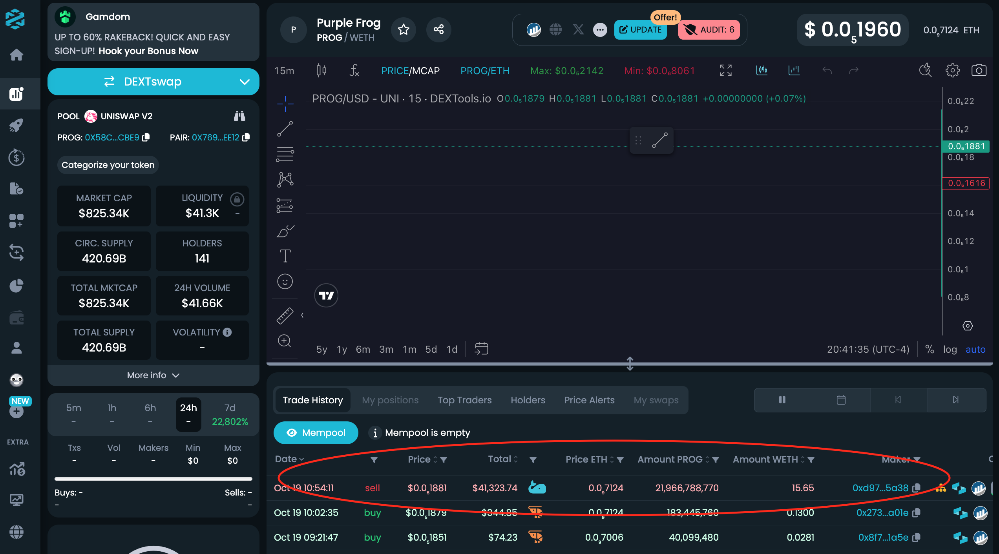

*Figure: Screenshot of Dextools analysis.*

DEXTools Analysis Findings:

Liquidity Pool Drain:
As shown in the chart, $41,323.74 worth of liquidity was removed (scammed) by the owner. This is a major indication that the project’s liquidity was drained, leaving investors unable to trade the token effectively. This is a textbook example of a rug pull scam, where the token creator or owner removes liquidity, making the token worthless and trapping investors.

Ownership Control:
The transaction history shows a massive sell order (21,966,788,770 tokens) from 0xd97…5a38, which could very well be the owner or someone with insider access. This sale resulted in the removal of significant liquidity, which likely contributed to the token’s sudden price crash.

Price Volatility:
The price volatility of the token is extreme. It reached a high of $0.0.8061 and then dropped down to $0.0.1881. This is characteristic of pump-and-dump schemes, where a token's price is artificially inflated to trap buyers before crashing after significant liquidity is removed.

Market Cap vs. Circulating Supply:
The market cap is $790.52K, and the circulating supply is 420.69B tokens. Despite these figures, the liquidity is very low at $41.3K, further supporting the idea that the liquidity pool was drained, leaving the project in a non-functional state.

Conclusion:
Based on the findings from DEXTools, this project shows clear signs of a rug pull, with the owner removing over $41,000 from the liquidity pool. The lack of remaining liquidity and the extreme price crash indicate that the token’s value has been purposely manipulated for fraudulent gains, leaving investors trapped with worthless tokens.
